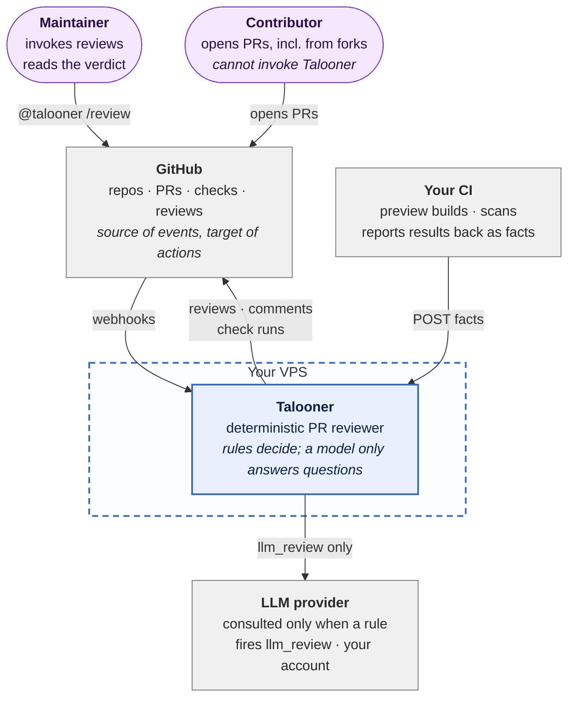
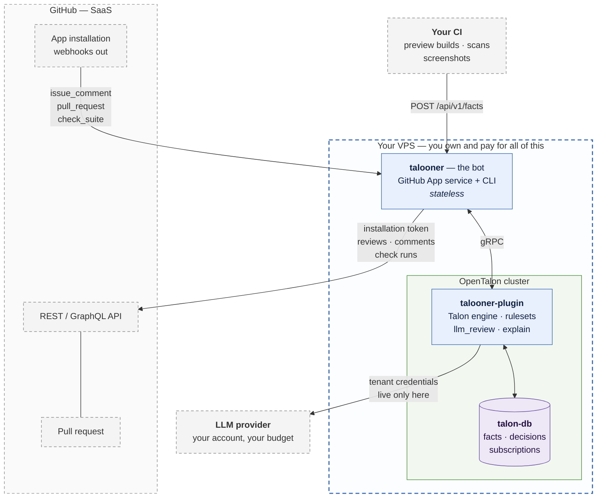
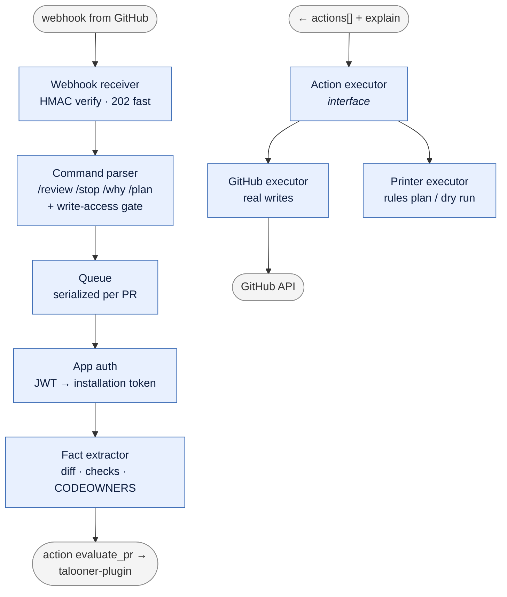
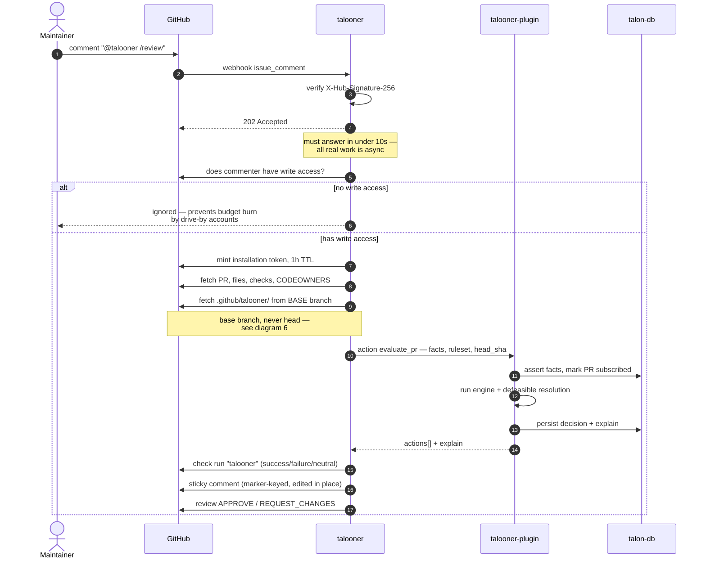
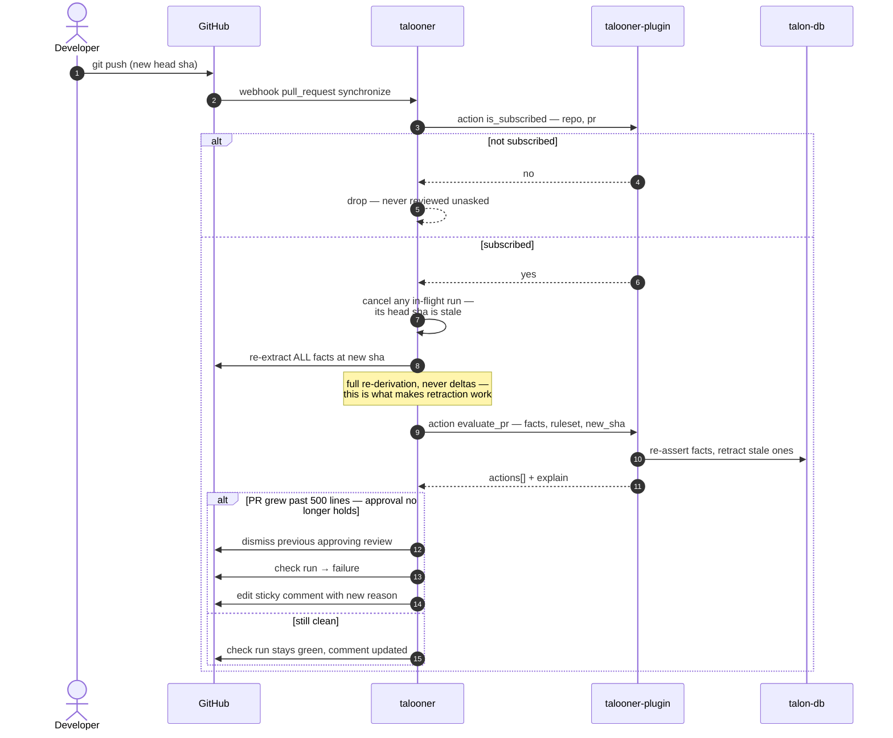
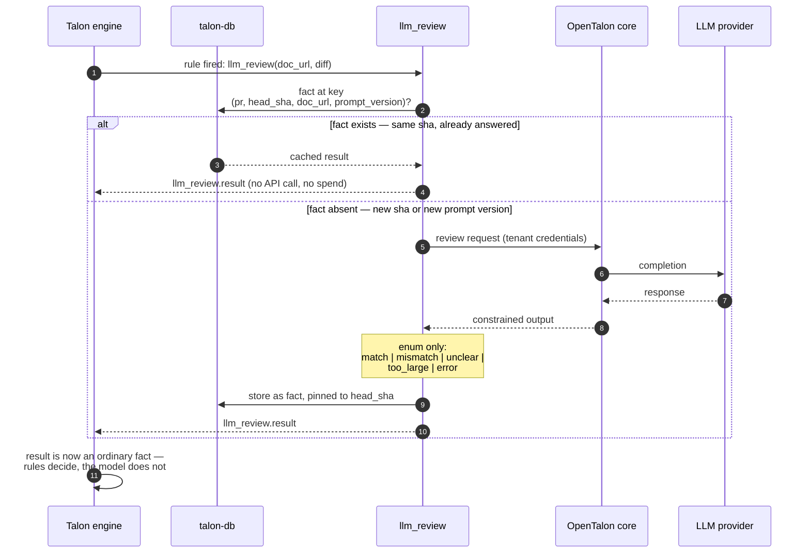
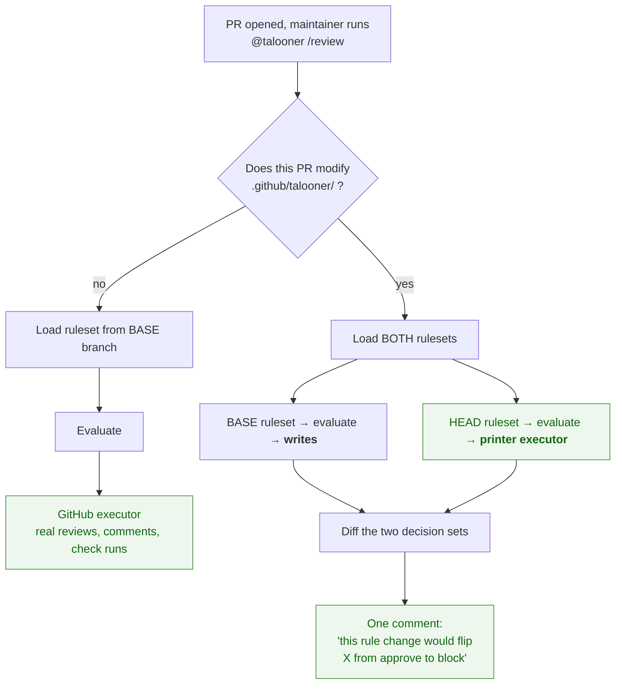
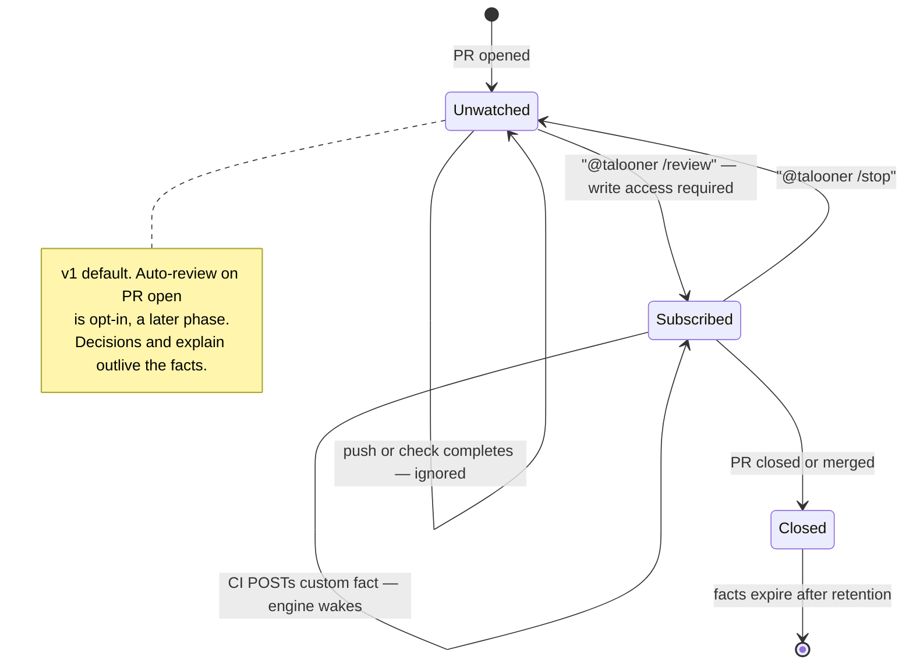
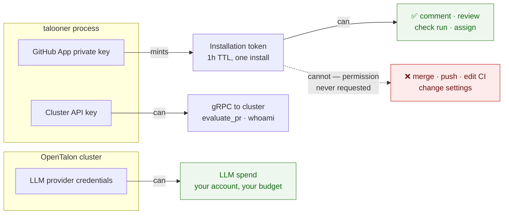
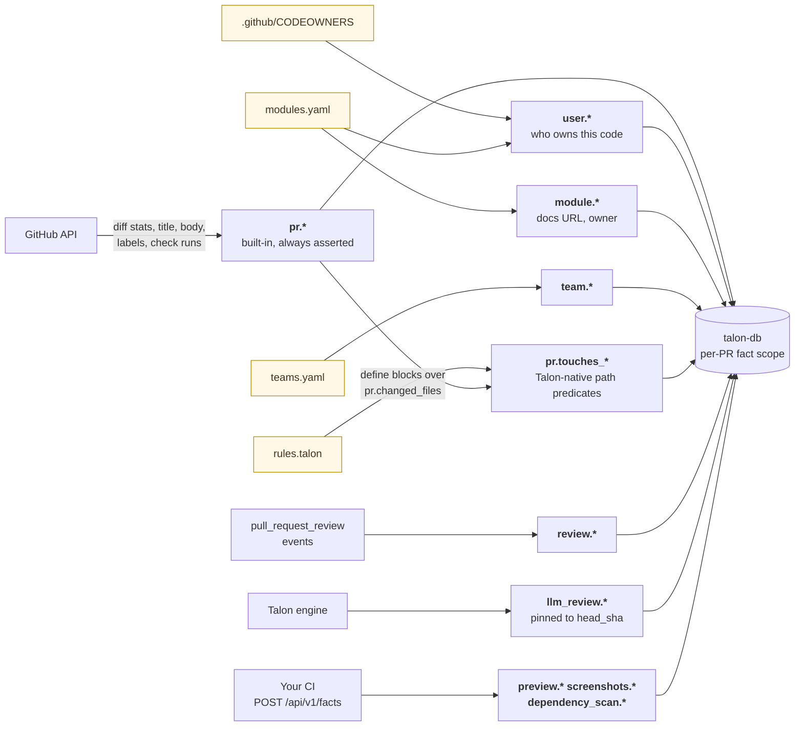

# Talooner — design diagrams

Shareable overview for the dev team. Mermaid, so it renders on GitHub and stays
diffable in review.

Companion docs: `architecture.md` (prose), `facts.md`, `actions.md`, `auth.md`,
`roadmap.md`.

## Notation

**C4 for structure, UML for behaviour.** Nothing else.

| Level | Diagram | Notation |
|---|---|---|
| C4 L1 — Context | §0 | Mermaid `flowchart` |
| C4 L2 — Container | §1 | Mermaid `flowchart` |
| C4 L3 — Component | §2a | Mermaid `flowchart` |
| C4 L4 — Code | — | Skipped. The code is the code. |
| Behaviour | §3–§6 | UML sequence |
| Behaviour | §7 | UML state machine |
| Supporting | §8, §9 | Mermaid `flowchart` |

Two notation decisions worth knowing before someone "fixes" them:

- **Not full UML.** Class and deployment diagrams would encode decisions that
  aren't made yet and go stale on the first refactor. Sequence and state
  diagrams are the parts of UML that are genuinely universal, so those we use.
- **Not Mermaid's native `C4Context` / `C4Container` syntax**, despite following
  the C4 model. It's still experimental and has no real layout engine —
  relationship labels land on top of the boxes and everything stacks into one
  column. Plain `flowchart` renders the same model correctly. Revisit if
  Mermaid's C4 support gets a layout engine.

| # | Diagram | Answers |
|---|---|---|
| 0 | System context (C4 L1) | Who uses it, what it touches, who pays |
| 1 | Containers (C4 L2) | What runs where inside the boundary |
| 2a | Components (C4 L3) | The bot's internals; the plugin's are in `talooner-plugin/diagrams.md` §2 |
| 3 | `@talooner /review` flow | The v1 happy path, end to end |
| 4 | Re-evaluation on push | Reactive rules, and retraction |
| 5 | `llm_review` | Why there's no cache layer, and where determinism comes from |
| 6 | Fork PRs | Which ruleset governs writes |
| 7 | PR lifecycle | When the bot is and isn't watching |
| 8 | Credentials | Blast radius per secret |
| 9 | Fact sources | Where every fact comes from |

All diagrams verified rendering with `mermaid-cli` 11.16.

---

## 0. System context — C4 L1

Zoomed all the way out: who uses Talooner, what it talks to, and where the money
goes. One box for the whole system.

Two things this level exists to make unmissable:

- **Contributors cannot invoke Talooner.** Only someone with write access can.
  That single arrow removes most of the fork threat model.
- **Every external arrow costs the VPS owner money, and nobody else.** There is
  no shared service in this picture, by design and permanently.

---

## 1. Containers — C4 L2

Everything inside the dashed boundary runs on **your** VPS. There is no hosted
Talooner, no shared service, no third party.

Two things to read off this diagram:

- **The bot never touches an LLM.** Provider credentials live in the cluster and
  nowhere else. Compromise the bot, you get GitHub comment access; compromise the
  cluster, you get LLM spend. Never both.
- **Preview builds and scans are your CI's job.** Talooner has no dispatch verb
  for them. Your workflow does the work and POSTs the result as a fact; rules
  react to that fact.

---

## 2. Components — C4 L3

### 2a. `talooner` — knows GitHub, knows nothing about Talon

### 2b. `talooner-plugin` — knows Talon, knows nothing about GitHub

Lives in the other repo:
[`talooner-plugin/diagrams.md`](https://github.com/opentalon/talooner-plugin/blob/main/diagrams.md)
§2. Ruleset loader → engine → `llm_review` → defeasible resolution → `explain`,
all over `talon-db`.

The seam: the plugin returns an **abstract action list**, the bot translates it
into API calls. Consequences worth stating to the team —

- `talooner-plugin` is testable with zero GitHub fixtures.
- The bot holds no engine state, so it restarts freely.
- `rules plan` is not a separate code path. It's the same evaluation with the
  printer executor swapped in. Build the interface in phase 1 and dry-run is
  nearly free in phase 2.

---

## 3. Flow — `@talooner /review`

The v1 entry point. Nothing happens until a human asks.

---

## 4. Flow — subscribed re-evaluation, and retraction

Once invoked, the PR is watched. This is where reactive rules
(`when "pr.files_changed" changes`) earn their keep.

**Reversibility is not uniform** — worth calling out to the team:

| Action | Reversible | On retraction |
|---|---|---|
| `approve` | yes | dismiss review, check → neutral |
| `block` | yes | check → success, dismiss REQUEST_CHANGES |
| `comment` | partly | edit to resolved state, never delete |
| `assign` / `require` | yes | remove assignee / withdraw request |
| `notify` | **no** | a sent Slack message stays sent |

---

## 5. Flow — `llm_review`, and why there is no cache layer

The fact store **is** the cache. No separate layer, no invalidation logic: a new
commit produces a new sha, the fact is absent, the model runs again.

That gives the headline property: **same head sha + same base ruleset ⇒ same
actions, byte for byte.** A per-PR conversation is retained cluster-side for
continuity, but it never changes an answer already recorded.

---

## 6. Flow — fork PRs and the base-branch rule

The ruleset that governs writes always comes from the base branch. A PR that
edits the ruleset gets a read-only plan run instead.

Why this matters even though Talooner cannot merge:

- **Spend.** A fork PR adding a hundred `llm_review` rules would burn the
  maintainer's LLM budget.
- **Noise.** It could make the bot post attacker-authored text as a first-party
  review comment on the maintainer's repo.

Explicit invocation already blunts both — a maintainer must ask before anything
runs — but base-branch-only removes them, and the plan run means rule changes
stay reviewable.

---

## 7. PR lifecycle

Subscription is state, and the bot is stateless — so it lives in `talon-db` with
everything else. A bot restart must not silently stop watching a PR someone asked
it to watch.

---

## 8. Credentials and blast radius

| Credential | Held by | If leaked |
|---|---|---|
| GitHub App private key | bot | Comment/review as the bot on installed repos. **Cannot merge or push** — the permission isn't requested. Rotate; tokens die within 1h. |
| Cluster API key | bot | Burn that tenant's LLM budget. Rotate cluster-side. |
| LLM provider key | cluster only | Full provider account. Never transits the bot, a webhook, `talon-db`, or a log line. |

App permissions requested: `pull_requests: write`, `checks: write`,
`contents: read`, `metadata: read`, `members: read`. Explicitly **not**
requested: `contents: write`, `administration`, `workflows`.

---

## 9. Where facts come from

Everything yellow is **committed to the repo being reviewed**, under
`.github/talooner/`. The review policy is versioned, diffable, and unit-testable
with `.talon.test` — which is the claim no LLM-based reviewer can make.

Custom fact names are namespaced away from `pr.*` and `review.*`. Without that, a
workflow could POST `pr.tests_passing: true` and defeat the entire ruleset.

### One trap the team must know about

A condition on an **unset** fact evaluates to *unknown*, not false — and
`not <unknown>` is unknown, not true. Otherwise a PR whose fact extraction failed
sails through `not is "critical_path"` and gets auto-approved.

This is a property of `talon-language`'s evaluator, not of Talooner, and it is
the first thing phase 0 verifies. See `facts.md`, "Unset is not false".
