# Expert Review System — Specification

## Problem

Generic LLM code review is dull and doesn't solve the actual problem: real review is
company-specific. It depends on that company's vision of clean code, which paths in the
codebase are critical, and what must never be touched carelessly. A bare "ask an LLM to
review this diff" action can't encode that — it produces generic commentary, sometimes
hallucinated, sometimes just noise posted to look like work was done.

Talooner already runs deterministic rule-based checks against PRs via `tln`. This spec
extends that system so tln rules and docs become a domain-knowledge layer that an LLM
reads from, rather than an LLM guessing what matters. The result is a reviewer that
behaves like a human expert with knowledge of the codebase: it comments when something
violates encoded knowledge, and stays silent when the PR is legitimate.

## Principles

1. **Determinism is the product.** Every review outcome must trace back to a specific
   rule and doc. Never "the model decided" from inside a black box. We stay in charge of
   what gets checked and why. The LLM's job is to turn a rule violation into a
   well-explained, human-readable comment, using exactly the context we hand it — not to
   freelance a general review.
2. **tln decides what's worth an LLM call, not the other way around.** Letting an LLM
   pick which rules apply risks hallucination and can't be traced or budgeted. Instead,
   tln facts gate which code changes are worth sending to the model at all (token
   economy), and the model's output feeds back into tln facts, which rules then act on.
3. **Silence is a valid outcome.** Comment only when something actually violates
   encoded expert knowledge. Typical AI review tools always leave a comment to prove
   they ran — this causes miscommunication and works against simplicity when no comment
   was warranted at all.
4. **Two invariants enforce the trust boundary:**
   - bot (talooner) holds the GitHub token, never an LLM key.
   - cluster (talooner-plugin) holds LLM credentials, never a GitHub token.
   - Everything talooner reads comes from the base branch, so a fork PR can't redefine
     the rules or docs it's judged against.
   - Model output is constrained to a fixed enum; it can never self-approve a merge.
5. **Business goal.** Package a company's domain expertise (tln rules + docs) as an
   expert reviewer, and sell it as a subscription to other companies.

## Architecture

```
GitHub PR event (opened / synchronize / @talooner /review)
        │
        ▼
talooner (bot / GitHub Action)
  • holds the GitHub token — never an LLM key
  • reads everything from the BASE branch (fork-safe)
  • facts.PR() → pr.diff, pr.*
      └─ code.* layer facts ── THE GATE
           (models/controllers/services touched,
            resolved via conventions + architecture.yaml)
  • scans ruleset for doc refs, loads doc content from base branch
        │ gRPC EvaluateRequest{ facts, ruleset, docs[] }
        ▼
talon engine (talooner-plugin, in-cluster)
  • holds LLM credentials — never a GitHub token
  • PASS 1: run rules; a rule fires "review" per code_unit that matters
        │
        ▼
    tool "llm" "review" { doc attr "doc_ref"  diff attr "diff_slice" }
        │  input: unit's own doc + its own diff slice
        │  output: fixed enum (match | mismatch | unclear | too_large | error)
        │          + escaped explanation
        ▼
    result stored as a fact: llm_review.* on that code_unit
      cache key = (pr, head_sha, path, doc_ref, prompt_version)
      same SHA ⇒ read cached fact, no second model call (determinism)
        │
        ▼
  • PASS 2: rules re-run against llm_review.* facts
      mismatch ⇒ block "pr.merge" + comment "{explanation}"
        │ EvaluateResponse{ actions, explain, warnings }
        │ (llm_review is never itself returned as an action)
        ▼
talooner renders the report
  • `talooner` check run → red / green
  • one sticky comment, edited in place, aggregating all drifting units
```

### Diagram

```mermaid
flowchart TD
    EVT["GitHub PR event<br/>opened / synchronize / @talooner /review"]

    subgraph BOT["talooner (bot / GitHub Action)<br/>holds GitHub token — never an LLM key"]
        direction TB
        READ["Read everything from BASE branch<br/>(fork-safe: fork PR can't redefine rules/docs)"]
        FACTS["facts.PR()<br/>pr.diff, pr.*"]
        GATE["code_unit records — THE GATE<br/>one per touched service/model/controller<br/>attrs: kind, path, important, doc_ref, diff_slice<br/>resolved via conventions + architecture.yaml"]
        ROLLUP["PR-level rollup facts (cheap gating)<br/>code.models_changed / controllers_changed / services_changed<br/>code.touches_model / touches_controller / touches_service"]
        DOCS["Dedup doc_refs across units<br/>load content per doc from BASE branch<br/>(missing doc ⇒ warning, unit simply unreviewed)"]
        REQ["Build EvaluateRequest<br/>{ facts, ruleset, units[] CodeUnit, docs[] DocFile }"]

        READ --> FACTS --> GATE --> ROLLUP --> DOCS --> REQ
    end

    subgraph CLUSTER["talon engine / talooner-plugin (in-cluster)<br/>holds LLM credentials — never a GitHub token"]
        direction TB
        P1["PASS 1: run rules<br/>rule fires review for each important code_unit"]
        CACHE{"Cache hit?<br/>key = pr + head_sha + path + doc_ref + prompt_version"}
        TOOL["tool 'llm' 'review'<br/>{ doc: doc_ref, diff: diff_slice }"]
        LLM["LLM call (via opentalon host)<br/>constrained output"]
        ENUM["Fixed enum result<br/>match | mismatch | unclear | too_large | error<br/>+ escaped explanation"]
        FACT["Store as fact: llm_review.* on code_unit<br/>(never returned as an action itself)"]
        P2["PASS 2: rules re-run against llm_review.* facts"]
        BLOCK["mismatch ⇒ block 'pr.merge'<br/>+ comment '{path}: {explanation}'"]
        ERR["result == error ⇒ WhyNotEvaluated path<br/>(never crash, never silently approve)"]
        BUDGET{"Per-PR / per-tenant<br/>budget exhausted?"}

        P1 --> CACHE
        CACHE -- "HIT: skip model call" --> FACT
        CACHE -- "MISS" --> BUDGET
        BUDGET -- "yes" --> ERR --> FACT
        BUDGET -- "no" --> TOOL --> LLM --> ENUM --> FACT
        FACT --> P2 --> BLOCK
    end

    subgraph REPORT["talooner renders the report"]
        direction TB
        CHECK["'talooner' check run → red / green"]
        COMMENT["One sticky comment, edited in place<br/>aggregates all drifting units<br/>'k of n units drifted'"]
    end

    EVT --> BOT
    REQ -- "gRPC EvaluateRequest" --> P1
    BLOCK -- "EvaluateResponse{ actions, explain, warnings }" --> REPORT

    style BOT fill:#1e3a5f,color:#fff
    style CLUSTER fill:#4a2f1e,color:#fff
    style REPORT fill:#2f4a2f,color:#fff
    style CACHE fill:#5f1e3a,color:#fff
```



**Trust boundary, at a glance:** the bot never sees an LLM key; the cluster never sees a
GitHub token. Model output can only ever become one of five enum values — it cannot
self-approve a merge, and it never appears directly as an action.

## Key decisions

1. Review is a tln `tool` call (`tool "llm" "review" {...}`), synchronous, delegated to
   opentalon through a host-backed `ToolResolver` — reusing the existing tln-plugin
   bridge. Not a bespoke `do llm_review` verb, and no provider credentials live in
   talooner-plugin.
2. Per-service granularity: one `code_unit` record per touched entity
   (model/controller/service), each carrying its own `doc_ref` and `diff_slice`. This is
   a deliberate cardinality change from today's single-eval-per-PR binding — it's what
   makes "a different doc per service" work, and it keeps each review focused and
   cheap.
3. Doc mapping lives in `architecture.yaml` / repo convention, not in the rule itself.
   Rules reference `attr "doc_ref"` per record, so different services can point at
   different docs without rule changes.
4. Determinism is preserved by a cache-wrapping resolver keyed per unit
   `(pr, head_sha, path, doc_ref, prompt_version)`. Each unit's model call happens at
   most once per SHA; re-runs read the stored fact. This is load-bearing, not an
   optimization.
5. Model output re-enters the system as facts via enrich/collect, consumed by ordinary
   tln rules — replacing any two-pass ad hoc loop with plain rule evaluation. The
   enrich guard (`important == true`) is the token-economy gate; per-unit diff slicing
   cuts tokens further.
6. Doc source is a per-repo file, loaded by the bot (which holds the GitHub token) and
   shipped to the cluster in a `docs[]` request field — this is what reconciles
   per-repo docs with fork-safety.
7. Architecture/layer knowledge is conventions + YAML override today. The extraction
   function takes the layer map as an argument, leaving a seam for a DB-backed,
   per-language knowledge base later with no change to callers or fact names.

## Build order

Phase 1 (bot-side fact layer) is self-contained, shippable, and testable in talooner
alone — it delivers the gate independently of the LLM loop. Phases 2–5 (proto field,
plugin streaming handler, opentalon LLM tool) must land together since they form one
loop.

### Phase 1 — talooner: codebase-knowledge fact layer

The gate that decides what's worth sending to the LLM. Mirrors the existing `module.*`
extractor pattern.

- New `internal/facts/architecture.go` (model on `internal/facts/modules.go:19-95`):
  given `[]github.FileStat` changed files + a layer config, produce one `code_unit`
  record per touched entity (service/model/controller), attrs
  `{ kind, path, important, doc_ref, diff_slice }`, plus PR-level roll-up facts for
  cheap gating: `code.models_changed` / `controllers_changed` / `services_changed`
  (lists), `code.touches_model` / `touches_controller` / `touches_service` (bool).
  This is a cardinality change — the engine sees N `code_unit` records per PR instead
  of the single PR record bound to the primary module (today's `module.*` shortcut).
  Use the same prefix-match helper style as `moduleOwns` (`modules.go:89-95`) and the
  same "assert explicitly, negatives included" discipline (`facts.go:8-11`) — no
  partial sets; on failure return an error.
- Per-unit doc mapping: `doc_ref` resolves from `architecture.yaml` (path/prefix→doc)
  or a co-located convention (e.g. `app/services/orders_service.rb` →
  `docs/services/orders.md`). Rules never hardcode a path — they reference
  `attr "doc_ref"` per record, which is what lets each service use a different doc.
- Per-unit diff slicing: split `pr.diff` by file into each unit's `diff_slice` so a
  review sees only its own hunks (accuracy + token economy + independent caching).
  Reuse the diff parsing already in `internal/action/diff.go` /
  `facts/dependencies.go`.
- Conventions + override: built-in per-language layer maps in code (Rails:
  `app/models/`, `app/controllers/`, `app/services/`; Go: `internal/`, `cmd/`,
  package dirs), detected by manifest/file presence like `dependencies.go:97-148`
  dispatches by manifest. Override/extension via
  `.github/talooner/architecture.yaml` (new `config.ParseArchitecture`, model on
  `config/modules.go:14-80`), read from the base branch in `run.go` alongside
  `modules.yaml` (`run/run.go:189-239`).
- Wire into `facts.PR()` (`internal/facts/pr.go:66-183`): call
  `architectureFacts(s, stats, arch)` next to `moduleFacts(s, ...)`. Thread the parsed
  arch config through `run.go`'s load sequence and the `facts.PR(...)` signature.
- Docs/tests: extend `facts.md` `code.*` section; add `architecture_test.go`
  mirroring `TestPRModuleFacts` (`pr_test.go:628`).
- Seam for the future knowledge DB: `architectureFacts` takes the layer map as an
  argument. Today it comes from conventions+yaml; later it can come from a
  per-language DB lookup with no change to callers or fact names.

### Phase 2 — talooner: per-unit doc loading + evaluate contract

- Doc set = each touched unit's `doc_ref` (from Phase 1), deduplicated. No ruleset
  scanning needed — the docs to load are exactly the resolved `doc_refs`. Done in
  `internal/run/run.go` after fact extraction (`run.go:235`).
- Load content from base branch: for each `doc_ref`,
  `r.GitHub.FileContent(ctx, owner, repo, path, pr.BaseRef)` — same call already used
  for `rules.tln` (`run.go:192`). Skip-with-warning on a missing doc (surfaced as a
  talooner warning, not a crash); a unit with no doc simply isn't reviewed. Per-doc
  size cap consistent with the 1 MB diff cap.
- New wire fields: `repeated CodeUnit units` (kind, path, important, doc_ref,
  diff_slice) and `repeated DocFile docs` (path + content) on `EvaluatePrRequest`
  (`talooner-plugin/proto/talooner/v1/talooner.proto:136-151`), following the
  existing `repeated TouchedModule modules` precedent. Regenerate protos in both
  repos. Extend `cluster.EvaluateRequest` (`internal/cluster/evaluate.go:44`) and
  marshal at the call site (`evaluate.go:53-98`), populated from `run.go:240-259`.
  Plugin-side, assert each `CodeUnit` as a `type == "code_unit"` record in the PR
  scope.

### Phase 3 — talooner: the report

The tool call executes cluster-side and is never returned to the bot; the bot only
ever sees approve/block/comment/assign/require. The review runs per `code_unit` and
the report aggregates across units:

```tln
# review each touched, important unit against ITS OWN doc (Phase 4 enrich block)
enrich "review" for records where type == "code_unit" and attr "important" == true {
  tool "llm" "review" { doc attr "doc_ref"  diff attr "diff_slice" }
  update "llm_review.result"      from "verdict"
  update "llm_review.explanation" from "explanation"
}

rule "Block on any documented-behavior drift" {
  for records where type == "code_unit" and attr "llm_review.result" == "mismatch"
  block "pr.merge"
  do comment "pr" "{attr.path}: {attr.llm_review.explanation}"   # one line per drifting unit
}
```

- Multiple comment actions (one per drifting unit) must fold into the single sticky
  comment — `internal/comment/` needs to aggregate rather than post N comments; this
  is the main bot-side rendering change per-service granularity introduces.
  Check-run summary (`internal/check/`) reports "k of n units drifted."
- `{attr.path}` / `{attr.llm_review.explanation}` arrive as ordinary comment action
  text (interpolation is cluster-side), so no new action type is needed.
- Add a `WhyNotEvaluated`-style path for units whose `llm_review.result == "error"`
  (`run/run.go:567-591` is the pattern). No `llm_review` verb in
  `action/executor.go`.

### Phase 4 — talooner-plugin: the review as a tool call, delegated to opentalon

Adopt the proven tln-plugin bridge instead of reimplementing an LLM client. The
review is a tln tool call serviced by a host-backed `ToolResolver`; the plugin holds
no provider credentials.

- Become a streaming handler: implement `plugin.StreamingHandler`
  (`ExecuteWithCallbacks(ctx, req, host)`), set `SupportsCallbacks: true` in
  Capabilities. Pattern: `tln-plugin/runtime/handler.go:180-195, 335, 404-449`;
  interfaces in `opentalon/pkg/plugin/streaming.go:14-43`.
- Install a cache-wrapped `ToolResolver`: during `evaluate_pr`, run the engine with
  `tln.NewSession(src, tln.WithToolResolver(r))` (or the equivalent embed path
  already used in `internal/service/evaluate.go`). The enrich block iterates
  `code_unit` records, so `r.Call` fires once per unit with that unit's `doc_ref` +
  `diff_slice`:
  a. compute per-unit cache key `(pr, head_sha, path, doc_ref, prompt_version)`; HIT
     ⇒ return stored verdict, no host call — preserves determinism through a
     non-deterministic dependency, per unit;
  b. MISS ⇒ `host.RunAction(ctx, "<llm-plugin>", "review", args)` — opentalon runs it
     through `executeCall` with credential injection + usage tracking
     (`opentalon/internal/orchestrator/orchestrator.go:4406-4663`);
  c. constrain/parse to the fixed enum `match|mismatch|unclear|too_large|error` +
     escaped explanation; store as the cache fact; return.
- Result becomes facts per unit: enrich/collect assert the response as
  `llm_review.*` on each `code_unit` record (executor `collect.go:18-44` /
  `enrich.go:25-91`). Rules then aggregate across units — no bespoke two-pass verb
  needed; the `enrich … for records where type == "code_unit" and important` guard
  is the token-economy gate.
- Doc content for each unit comes from the `docs[]` request field (Phase 2), keyed
  by that unit's `doc_ref`; the diff is the unit's `diff_slice`, not the whole
  `pr.diff`.
- Guardrails: per-PR call cap (counted across units) + per-tenant budget enforced in
  the resolver → on exhaustion assert `llm_review.result="error"` on remaining units
  (never crash, never silently approve); `force` bypasses the cache only, not
  budgets. Prompt lives in a `.txt` file; VCR cassettes; determinism test: same facts
  twice ⇒ byte-identical actions + exactly one host call
  (`talooner-plugin/testing.md:88-107`).
- Update the design docs: `llm-review.md` + `facts.md:128-140` — the review is a
  host-delegated tool call over per-repo docs, cached as a fact; `doc_ref` is a repo
  path (was `doc_url`). The old `do llm_review` two-pass framing is superseded.

### Phase 5 — opentalon: runtime/provider + the LLM tool

- Expose an LLM review tool/action the resolver targets via `RunAction` — either a
  small dedicated plugin (`guard-llm` is the closest reference,
  `guard-llm-plugin/main.go`) or a built-in orchestrator action. Takes `{doc, diff}`,
  calls `internal/provider` (`factory.go:41-67`), returns the enum verdict +
  explanation.
- Provider config: tenant model + `${ENV}` keys in
  `opentalon/config.example.yaml:4-50` / `internal/config/config.go:672-678`.
  Credentials live here only.
- Capability handshake: advertise the feature so the bot's `whoami`
  (`talooner/internal/cluster/cluster.go:220-236`) passes when a ruleset needs
  review; surface quota there.

### tln-language: no grammar change required

`tool "server" "tool" { named args }` already parses (`grammar.ebnf:334-336`,
`parser.go:793-821`) and executes synchronously via `ToolResolver`
(`internal/executor/mcp.go:5-35`, installed by `tln.WithToolResolver`,
`pkg/tln/api.go:165-190`). Tool calls are valid in collect/enrich/workflow/remediate
bodies, not inside a plain rule's `do` — which is why the review lives in an
enrich/collect block, not a `do` clause. Optional docs-only touch: add an
LLM-review example to `tln-language/docs/actions.md`.

## Deferred (explicitly out of scope now)

- Per-language codebase-knowledge database (the facts layer is designed to accept it
  later without renaming or re-plumbing).
- Reactive/auto wake review (stays `/review`-driven for now).
- Org-level shared rulesets.

## Verification

- Phase 1: `go test ./internal/facts/...` — new fixtures assert every `code.*` fact for
  Rails and Go, including negative cases.
- Contract: proto round-trip test that a `docs[]` payload survives marshal/unmarshal in
  both repos.
- Plugin loop: VCR-backed test — a PR whose diff contradicts its doc yields
  `llm_review.result="mismatch"` and a block + comment with the quoted explanation.
  Determinism test: identical facts evaluated twice ⇒ byte-identical actions and exactly
  one LLM call; mutating one fact retracts the prior action. Budget-exhaustion test ⇒
  `result="error"`, never a silent approval.
- End-to-end: on a scratch repo with a doc and a matching rule pair, a PR that violates
  the doc turns the check red with a sticky comment quoting the explanation; re-running
  `/review` at the same SHA produces identical output and no new LLM spend.
- `golangci-lint run` clean in each touched repo.
